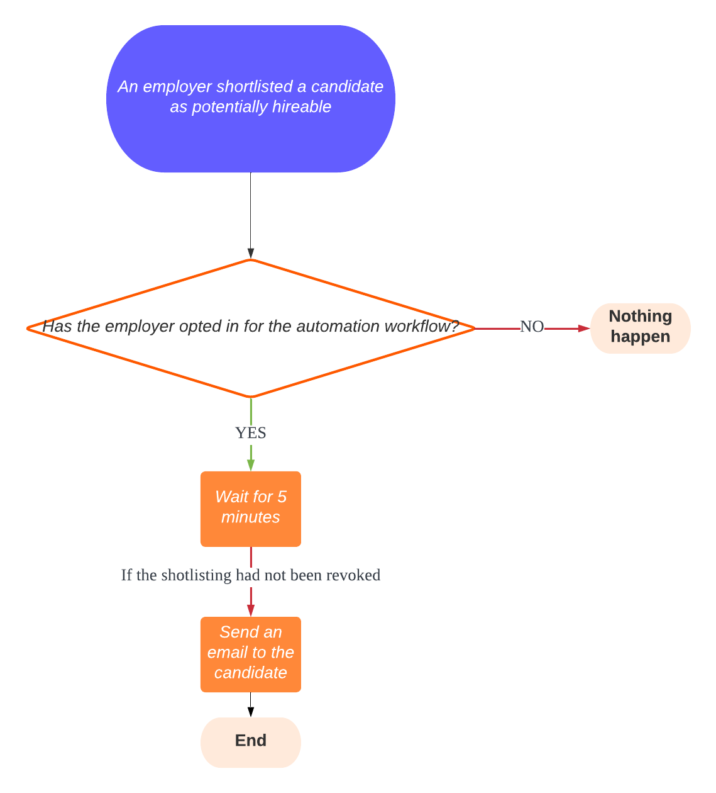

# iwf-java-samples

Samples for [iWF Java SDK](https://github.com/indeedeng/iwf-java-sdk) that runs
against [iWF server](https://github.com/indeedeng/iwf).

We also have smaller [code snippets](https://github.com/indeedeng/iwf-java-code-snippets) (also known as mini demos) that demonstrate how to utilize [iWF](https://github.com/indeedeng/iwf) to perform a minimum funcion.

## Setup

1. Start a iWF server following the [instructions](https://github.com/indeedeng/iwf#how-to-run-this-server)
2. Run this project by using gradle task `bootRun`.

_Note that by default this project will listen on 8803 port

## Design Patterns
Check out all the [design patterns](./src/main/java/io/iworkflow/patterns) that we use iwf to build applications.

### [Cron Schedule Workflow](./src/main/java/io/iworkflow/patterns/workflow/cron)
A pattern for replacing traditional Orc jobs with workflow-based cron scheduling. This pattern demonstrates how to use scheduled workflows to execute tasks at specified intervals using CRON expressions. Key features include automatic initialization, configurable scheduling, and management through Temporal Cloud UI.

**Use Cases**: Periodic data processing, cleanup tasks, automated reports, scheduled maintenance
**Endpoints**: N/A (automatically scheduled)

### [Drain Channels Patterns](./src/main/java/io/iworkflow/patterns/workflow/drainchannels)

#### [Drain Internal Channels](./src/main/java/io/iworkflow/patterns/workflow/drainchannels/internal)
Demonstrates graceful shutdown of internal communication channels between workflow threads. One thread sends commands through internal channels while another continuously processes messages, ensuring no messages are lost during shutdown.

**Use Cases**: Consumer-producer patterns, message processing with graceful shutdown
**Endpoints**: `GET /design-pattern/drainchannels/internal/start?workflowId={workflowId}`

#### [Drain Signal Channels](./src/main/java/io/iworkflow/patterns/workflow/drainchannels/signal)
Shows how to process signals until channels are empty, then immediately complete the workflow to keep it short-lived. Uses atomic checking to determine if channels are empty before closing.

**Use Cases**: Processing queued refund requests, LLM evaluation with bandwidth limits
**Endpoints**: `GET /drainchannels/signal/startorsignal?workflowId={workflowId}`

### [Interruptible Execution](./src/main/java/io/iworkflow/patterns/workflow/interruptible)
Allows workflows to be gracefully interrupted and terminated based on external signals. This pattern enables dynamic control over long-running workflow execution with proper state management.

**Use Cases**: Dynamic task management, resource optimization, error handling and recovery
**Endpoints**: 
- Start: `GET /design-pattern/interruptible/start?workflowId={workflowId}`
- Cancel: `GET /design-pattern/interruptible/cancel?workflowId={workflowId}`

### [Manual Intervention](./src/main/java/io/iworkflow/patterns/workflow/intervention)
Handles scenarios where API calls fail and require human intervention to retry or skip operations. Supports manual interaction through Temporal Cloud UI, built-in endpoints, or custom RPC endpoints.

**Use Cases**: API failure handling, manual decision points, external system integration issues
**Endpoints**: `GET /design-pattern/intervention/start?workflowId={workflowId}`

### [Parallel States](./src/main/java/io/iworkflow/patterns/workflow/parallel)
Demonstrates running multiple states concurrently with two variants: simple parallel execution and parallel execution with await completion. Supports both different states running in parallel and the same state running multiple times.

**Use Cases**: Independent concurrent operations, bulk processing, simultaneous notifications
**Endpoints**:
- Simple: `GET /parallel/start/simple?workflowId={workflowId}`
- With Await: `GET /parallel/start/withAwait?workflowId={workflowId}`

### [Parent-Child Workflows](./src/main/java/io/iworkflow/patterns/workflow/parentchild)
Shows how to start child workflows and wait for their completion using client API. This pattern supports many-to-many relationships between parent and child workflows, making it more flexible than signal-based approaches.

**Use Cases**: Fan-out execution patterns, hierarchical task processing
**Endpoints**: Varies based on implementation

### [Polling Patterns](./src/main/java/io/iworkflow/patterns/workflow/polling)

#### Simple Polling
Periodically checks external system readiness using timer commands with consistent intervals.

#### Backoff Polling  
Uses exponential backoff retry mechanism with state API retry policies for more efficient resource usage.

**Use Cases**: External system readiness checks, data ingestion, payment verification, resource availability monitoring
**Endpoints**:
- Simple: `GET /design-pattern/polling/start/simple?workflowId={workflowId}`
- Backoff: `GET /design-pattern/polling/start/backoff?workflowId={workflowId}`

### [Failure Recovery](./src/main/java/io/iworkflow/patterns/workflow/recovery)
Implements the Saga pattern for handling failures in multi-step transactions with compensation actions. Demonstrates both state API backoff retry and failure recovery mechanisms.

**Use Cases**: Payment processing, distributed transactions, multi-step operations requiring rollback
**Endpoints**: `GET /recovery/start?workflowId={workflowId}&itemName={itemName}&quantity={quantity}`

### [Reminders](./src/main/java/io/iworkflow/patterns/workflow/reminders)
Sends periodic reminders to users while handling opt-out requests and managing timeouts. Includes automatic reminder scheduling and user preference management.

**Use Cases**: User engagement, task completion reminders, automated follow-ups
**Endpoints**:
- Start: `GET /design-pattern/workflow-with-reminder/start`
- Accept: `GET /design-pattern/workflow-with-reminder/accept?workflowId={workflowId}`
- Opt-out: `GET /design-pattern/workflow-with-reminder/optout?workflowId={workflowId}`

### [Resettable Timer](./src/main/java/io/iworkflow/patterns/workflow/resettabletimer)
Implements a timer that can be reset before firing, useful for scenarios requiring action after periods of inactivity with the ability to restart the countdown.

**Use Cases**: Inactivity notifications, data cleanup after abandonment, time-sensitive processes
**Endpoints**:
- Start: `GET /design-pattern/resettabletimer/start?workflowId={workflowId}`
- Reset: `GET /design-pattern/resettabletimer/reset?workflowId={workflowId}`

### [Scalable Parallel Processing](./src/main/java/io/iworkflow/patterns/workflow/scalableparallel)
Advanced parent-child pattern for high scalability with unlimited request acceptance, partitioned processing, and configurable parallelism control. Includes request buffering and queue management.

**Use Cases**: CSV file processing, large dataset analysis, high-volume task processing
**Endpoints**: `GET /design-pattern/parallelism/start?workflowId={workflowId}&numOfChildWfs={number}`

### [Storage Pattern](./src/main/java/io/iworkflow/patterns/workflow/storage)
Implements a singleton workflow acting as persistent storage service with RPC-based operations. Provides long-lived data persistence across workflow executions with a 4MB storage limit.

**Use Cases**: Small database replacement, persistent workflow state, demo/MVP data storage
**Endpoints**:
- Add: `POST /design-pattern/storage/add`
- Get: `GET /design-pattern/storage/get` 
- Remove: `POST /design-pattern/storage/remove`

### [Timeout Handling](./src/main/java/io/iworkflow/patterns/workflow/timeout)
Manages task execution within designated time frames with parallel timeout monitoring. Can forcibly terminate workflows that exceed time limits or handle timeouts gracefully.

**Use Cases**: Task duration control, preventing endless execution, time-bounded operations
**Endpoints**: `GET /design-pattern/timeout/start?workflowId={workflowId}&successfulWorkflow={boolean}`

### [Wait for State Completion](./src/main/java/io/iworkflow/patterns/workflow/waitforstatecompletion)
Notifies clients when operations complete while starting background processes. Simplifies architectures by replacing complex CDC patterns and polling mechanisms.

**Use Cases**: Database CDC replacement, frontend data rendering, background operation triggers
**Endpoints**: `GET /design-pattern/waitforstatecompletion/start?workflowId={workflowId}`

## Product Use case samples

### [Money transfer workflow/SAGA Patten](src/main/java/io/iworkflow/workflow/money/transfer)
This example shows how to transfer money from one account to another account.
The transfer involves multiple steps. When any step fails, the whole transfer is canceled with some compensation steps.

### [User sign-up/registry workflow](src/main/java/io/iworkflow/workflow/signup)

A [common use case](src/main/java/io/iworkflow/workflow/signup) that is almost everywhere -- new user sign-up/register a new account in a website/system.
E.g. Amazon/Linkedin/Google/etc...

### [Microservice ochestration](https://github.com/indeedeng/iwf-java-samples/tree/main/src/main/java/io/iworkflow/workflow/microservices)
This is the code that is [shown in iWF server as an example of microservice orchestration](https://github.com/indeedeng/iwf#example-microservice-orchestration).

### [JobSeeker Engagement workflow](https://github.com/indeedeng/iwf-java-samples/tree/main/src/main/java/io/iworkflow/workflow/engagement)

See [Engagement](https://github.com/indeedeng/iwf-java-samples/tree/main/src/main/java/io/iworkflow/workflow/engagement)
for
how to build an jobSeeker engagement workflow.

* An engagement is initiated by an employer to reach out to a jobSeeker(via email/SMS/etc)
* The jobSeeker could respond with decline or accept
* If jobSeeker doesn't respond, it will get reminder
* An engagement can change from declined to accepted, but cannot change from accepted to declined

### [Job Post System (a mini Indeed.com)](https://github.com/indeedeng/iwf-java-samples/tree/main/src/main/java/io/iworkflow/workflow/jobpost)

See [JobPost](https://github.com/indeedeng/iwf-java-samples/tree/main/src/main/java/io/iworkflow/workflow/jobpost) for
how to build an JobPost system like Indeed.com

Support typical CRUD operations:

* Create a job with tile, description and notes
* Read a job
* Update a job
* Delete a job

And also

* Search for jobs using full-text search
* Update will trigger a background action to update external system with eventual consistency

### Subscription workflow

See [Subscription](https://github.com/indeedeng/iwf-java-samples/tree/main/src/main/java/io/iworkflow/workflow/subscription)
with [unit tests](https://github.com/indeedeng/iwf-java-samples/tree/main/src/test/java/io/iworkflow/workflow/subscription)
for the use case also described in:

* [Temporal TypeScript tutorials](https://learn.temporal.io/tutorials/typescript/subscriptions/)
* [Temporal go sample](https://github.com/temporalio/subscription-workflow-project-template-go)
* [Temporal Java Sample](https://github.com/temporalio/subscription-workflow-project-template-java)
* [Cadence Java example](https://cadenceworkflow.io/docs/concepts/workflows/#example)

In additional, iWF provides "Auto-ContinueAsNew feature to allow running the workflow infinitely

### [Shortlist Candidates workflow](https://github.com/indeedeng/iwf-java-samples/tree/main/src/main/java/io/iworkflow/workflow/shortlistcandidates)

See [ShortlistCandidates](https://github.com/indeedeng/iwf-java-samples/tree/main/src/main/java/io/iworkflow/workflow/shortlistcandidates)
for
how to build a workflow to automatically establish connections with shortlisted candidates on behalf of an employer.

* Design a workflow as long-term storage: leveraging the attributes of iWF to retain the employer opt-in information in [EmployerOptInWorkflow](https://github.com/indeedeng/iwf-java-samples/blob/main/src/main/java/io/iworkflow/workflow/shortlistcandidates/EmployerOptInWorkflow.java).
* Retrieve the attributes of another workflow from within a different workflow: checking the employer's opt-in status stored in the [EmployerOptInWorkflow](https://github.com/indeedeng/iwf-java-samples/blob/main/src/main/java/io/iworkflow/workflow/shortlistcandidates/EmployerOptInWorkflow.java) when making a decision on whether to automatically contact shortlisted candidates for that employer in the [ShortlistWorkflow](https://github.com/indeedeng/iwf-java-samples/blob/main/src/main/java/io/iworkflow/workflow/shortlistcandidates/ShortlistWorkflow.java).

