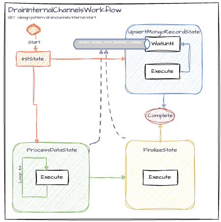

# DrainInternalChannelsWorkflow

This example workflow demonstrates a workflow where one thread (A) is responsible for sending commands through the internal channel, while another thread (B) continuously loops, waiting to receive those messages. It's important for thread B to receive a signal indicating when it should finish its task, as we want to avoid abruptly shutting it down and potentially losing messages. In this scenario, thread A communicates with thread B through an internal channel, sending a command to indicate that the final message has been received, allowing thread B to gracefully complete its process without losing any messages.

## Endpoints

To start the `DrainInternalChannelsWorkflow`, use the following REST endpoint:
```
GET /design-pattern/drainchannels/internal/start?workflowId={workflowId}
```

## Use Cases

- A consumer, consumes messages and upserts them to a data store.

## Workflow Details


<br>([diagram link](https://drive.google.com/file/d/1X7oRrjeDkZAWI_Zylx3wOP_S7ziyfsbG/view?usp=drive_link))

### Workflow States

1. **InitState**: Starts the workflow and starts the `UpsertMongoRecordState` and the `ProcessDataState` (two threads).
2. **ProcessDataState**: Publishes data to the internal channel, processes the data, and fake sends metrics and logs.
3. **UpsertMongoRecordState**: Waits for commands from the internal channel and upserts it into a fake MongoDB.
4. **FinalizeState**: Publishes a final document status to the internal channel so that the `UpsertMongoRecordState` can gracefully complete and completes the workflow. In more complex use cases, such as there are more than one threads sending message to threadB, (A1, A2, ... ), this FinalizeState could be more advanced to wait for all A* threads to complete, before sending the final message.

### Communication Channels

The workflow uses internal channels for communication between states:

- **Internal Channel**: `UPSERT_MONGO_DATA_INTERNAL_CHANNEL`
    - Used to send and receive `MongoDocument` objects between states.

### Persistence

- **PROCESS_DATA_STATE_EXECUTION_COUNTER**: An integer attribute used to track the number of times the `ProcessDataState` has been executed.

### Usage

Start the workflow with this: `http://localhost:8080/design-pattern/drainchannels/internal/start?workflowId=internalchanneltest`

