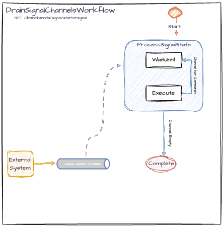

# DrainSignalChannelsWorkflow

## Overview

The `DrainSignalChannelsWorkflow` demonstrates a pattern where a workflow remains active only as long as there are signals to process, and close immediately when all signals are processed, to keep the workflow as short-lived as possible. The workflow can be started again as a different workflow execution (with the same workflowID), when new signals are received.
It's generally preferable to have multiple short-lived workflows rather than a single long-lived one, for reasons related to cost and code management, such as version control.
IWF offers the `StateDecision.forceCompleteIfSignalChannelEmptyOrElse()` feature for signal (external) channels and the `StateDecision.forceCompleteIfInternalChannelEmptyOrElse()` feature for internal channels ([wiki](https://github.com/indeedeng/iwf/wiki/Conditionally-complete-workflow-with-atomic-checking-on-signal-or-internal-channel) for both). These features allow for an atomic check to determine if the channel is empty before closing the workflow. *NOTE:* For this feature to maintain atomicity, the channel used must be consumed by only one workflow state. This example workflow waits for signals to be sent to the channel and then processes them until the channel is empty.

## Endpoints

To start or signal `DrainSignalChannelsWorkflow`, use the following REST endpoint:
*NOTE* call this endpoint twice in a row to start then signal.
```
GET /drainchannels/signal/startorsignal?workflowId={workflowId}
```

## Use Cases

- Refund requests for different invoice items are submitted to a queue, while there can be only one item being processed at a time for a particular invoice.
- In llm-eval service, we need to limit the concurrency of requests being processed. Requests are sent to a queue and processed with a fixed bandwidth.

## Workflow Details


<br>([diagram link](https://drive.google.com/file/d/1X7oRrjeDkZAWI_Zylx3wOP_S7ziyfsbG/view?usp=drive_link))

### Workflow States
**ProcessSignalState**:
    - If it's the first execution of `ProcessSignalState`, input should NOT be null, so the message from input will be processed instead of the message from the channel. 
    - If input is null, the state processes the signals received on the `QUEUE_SIGNAL_CHANNEL`.
    - Then waits 20 seconds, in case you want to add signals.
    - If the channel is not empty, it loops `ProcessSignalState`. If the channel is empty, the workflow forcefully completes. `StateDecision.forceCompleteIfSignalChannelEmptyOrElse()` is used to either loop or complete. To maintain atomicity, QUEUE_SIGNAL_CHANNEL can only be consumed by one state.

### Communication Channels

- **Signal Channel**:
    - **Name**: `QUEUE_SIGNAL_CHANNEL`
    - **Type**: `String`
    - **Purpose**: Used to receive signals that the workflow processes.

### Usage

1. Start a workflow using the above endpoint. Example:
```
http://localhost:8080/design-pattern/drainchannels/signal/startorsignal?workflowId=signalchanneltest
```
2. Use the same endpoint to signal the workflow. 
3. If you want to send more signals to the workflow rerun the endpoint from step 1 or send a signal from the Temporal Cloud UI:
- Click into the workflow in the UI
- Click "Send a Signal"
- Under "Signal name" choose "queueSignalChannel"
- In the data field put:
```json
{
  "data": "\"signal from ui\"",
  "encoding": "json"
}
```