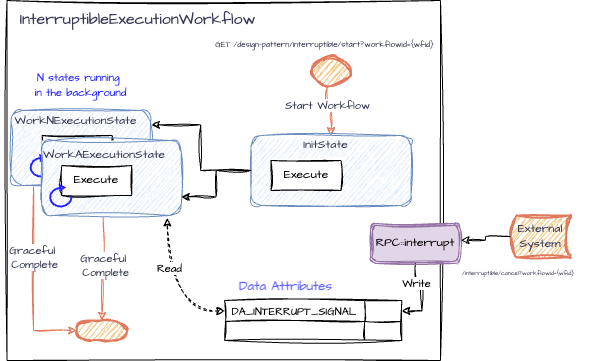

# Interruptible Workflow Pattern

Here we demonstrate an Interruptible Workflow Pattern implemented using the iWF.  
This pattern demonstrates how workflows can be designed to handle interruptions gracefully, allowing for dynamic control over workflow execution.

## Overview

The Interruptible Workflow Pattern allows a workflow to be interrupted and gracefully terminated based on external signals. This is particularly useful in scenarios where long-running tasks may need to be stopped due to changing requirements or external conditions.

### Key Components

1. **InterruptibleExecutionWorkflow**: The main workflow class that defines the states and handles interruptions.
2. **InitState**: The initial state that sets up the workflow and transitions to execution states.
3. **WorkAExecutionState** and **WorkNExecutionState**: Execution states that perform tasks and check for interrupt signals.

### Endpoints

The application exposes the following REST endpoints for managing the interruptible workflow:

- **Start Interruptible Workflow**:
  - `GET /design-pattern/interruptible/start?workflowId={workflowId}`
  - Starts the Interruptible Workflow with the specified `workflowId`.

- **Cancel Interruptible Workflow**:
  - `GET /design-pattern/interruptible/cancel?workflowId={workflowId}`
  - Sends an interrupt signal to the workflow, causing it to terminate gracefully.

## Use Cases and Considerations

### **Use Cases**

- **Dynamic Task Management**: Ideal for workflows that need to adapt to real-time changes, allowing modifications or termination based on external inputs.
- **Resource Optimization**: Efficiently conserves resources by terminating workflows that are no longer relevant.
- **Error Handling and Recovery**: Facilitates robust error management by interrupting workflows encountering unexpected issues.

### **Considerations**

- **Increased Complexity**: Implementing interruption logic can make workflow design more intricate.
- **State Management Challenges**: Demands careful handling of state transitions and persistence to ensure workflows function as intended.

## Workflow Details

### Interruptible Execution Workflow

- **States**:
  - `InitState`: Initializes the workflow and transitions to execution states.
  - `WorkAExecutionState`: Performs a specific task and checks for interrupt signals.
  - `WorkNExecutionState`: Performs another task and checks for interrupt signals.

- **Interruption Logic**: Uses a persistence data attribute (`interruptSignal`) to determine if the workflow should be interrupted. The workflow checks this attribute at each state execution and terminates if the signal is set to "cancel".

 ([diagram link](https://drive.google.com/file/d/1sDAFgptVkerT05jCr6x9KrsGhyHuNnD_/view?usp=sharing))

## Conclusion

The Interruptible Workflow Pattern provides a flexible and efficient way to manage long-running workflows that may need to be stopped or modified based on external conditions. By leveraging the iWF framework, this pattern enables dynamic control over workflow execution, optimizing resource usage and enhancing error handling capabilities.
