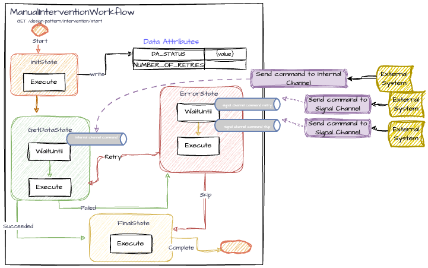

# Manual Intervention Workflow Pattern

The `ManualInterventionWorkflow` is a pattern for handling scenarios where an API call might fail, that requires manual intervention to retry or skip the operation. This workflow is particularly useful in situations where a call to an external API fails and requires human intervention to fix the issue. Once the issues is resolved, the workflow can either retry the call or skip it and proceed with the workflow.

## Endpoints

To start the `ManualInterventionWorkflow`, use the following REST endpoint:

```
GET /design-pattern/intervention/start?workflowId={workflowId}
```

## Use Cases

- **API Call Failure Handling**: When an API call fails, this workflow allows for retrying the call after the issue is resolved or skipping the call to continue with the workflow.
- **Manual Intervention**: If human interaction is need or more data is needed, a user can send a signal with or without data through the Temporal Cloud UI (internal channels and external signal channels supported) , using IWF's built-in endpoint (only external signal channels supported), or custom rpc endpoints defined in the workflow (internal channels and external signal channel supported).
## Workflow Details


<br>([diagram link](https://drive.google.com/file/d/1BNkKejs8cliG3pq5ZTQ2ynX2iILIfvx5/view?usp=drive_link))

### Workflow States

1. **InitState**:
    - Initializes the workflow by setting the `NUMBER_OF_RETRIES` data attribute to zero.
    - Transitions to `GetDataState`.

2. **GetDataState**:
    - Waits for incoming data through an internal channel and simulates an api call.
    - If the data received is "failed", a non-retryable exception is thrown, transitioning the workflow to `ErrorState`.
    - Otherwise, the workflow proceeds to `FinalState`.
    - Tracks retries using data attributes.

3. **ErrorState**:
    - Handles errors by waiting for a retry or skip signal channel command (external signals).
    - Transitions back to `GetDataState` on retry or to `FinalState` on skip.

4. **FinalState**:
    - Completes the workflow and returns the number of retries.

### Communication Channels

- **Internal Channel**:
    - `internal_channel_command` for receiving data, simulating an API call.

- **Signal Channels**:
    - `signal_channel_command_retry` for retrying the call.
    - `signal_channel_command_skip` for skipping the call.

### Persistence

- **Data Attribute**:
    - `number_of_retries` to track the number of retry attempts.

### Usage
1. Start a workflow using the above endpoint
2. Send a command to the internal channel through the Temporal Cloud UI:
- **Signal Name:** `__IwfSystem_ExecuteRpc`
- **Data:**

  ```json
  {
    "InterStateChannelPublishing": [
      {
        "channelName": "internal_channel_command",
        "value": {
          "encoding": "json",
          "data": "\"failed\""
        }
      }
    ]
  }
  ```
- If you want the "external call" to fail, leave the `data` value as `"failed"`.
- If you want the "external call" to succeed, update the `data` value to something else.

For more detailed information, please refer to the iWF Application Runbook

3. If the data value was `"failed"`, the workflow will move to the error state. Send a command to the signal channel through the Temporal Cloud UI or the IWF endpoint (see ManualInterventionCalls.http). To retry the operation and return to the GetDataState, send a command to the signal channel `signal_channel_command_retry`. To skip to the final state, send a command to the signal channel `signal_channel_command_skip`. This can be done with an API endpoint through the Temporal Cloud UI. For Temporal Cloud UI:
**Access the Temporal Cloud UI**: Navigate to the workflow you wish to intervene in.
**Send a Signal**: Select the "Send a Signal" option.
**Choose a Signal Channel Name**: Depending on the action you want to perform, use one of the following signal channel names:
      ```
      signal_channel_command_retry
      ```
      ```
      signal_channel_command_skip
      ```
For more information on how to send signals manually, refer to the wiki under "How To Send a Signal Manually".
