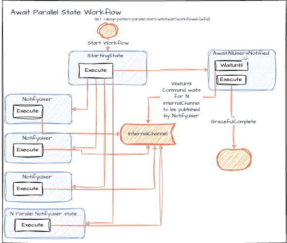

# Parallel Running States Pattern

Here we demonstrate how to take advantage of the parallel running states feature in iWF.

1. **Simple Parallel State Workflow**: This pattern demonstrates how to run multiple states in parallel.
2. **Await All Parallel States Workflow**: This pattern demonstrates how to run multiple states in parallel, plus how to wait for all parallel states to complete before proceeding to the next state.

This is a basic design pattern for parallel execution in a single workflow. For higher scalability needs. you can check out [scalable parallel](../scalableparallel) design pattern or [parentchild](../parentchild)

### Endpoints

The application exposes the following REST endpoints:

- **Start Simple Parallel State Workflow**:
    - `GET /parallel/start/simple?workflowId={workflowId}`
    - Starts the Simple Parallel State Workflow with the specified `workflowId`.
- **Start Await All Parallel States Workflow**:
    - `GET /parallel/start/withAwait?workflowId={workflowId}`
    - Starts the Await All Parallel States Workflow with the specified `workflowId`.

## Use Cases
* **Executing Multiple States concurrently**
    * You have steps in your workflow that you want to run, and they don't have any dependencies on each other.
    * For example: 
      * You have the following Jobseeker Data:
        * Phone Number 
        * Email Address
      * You want to send each of them an SMS message and an Email message.
      * You can create a state sends an SMS message to the jobseeker
      * You can create a state sends an Email message to the jobseeker
      * Because these actions are independent of each other, you can run them concurrently using Parallel Running States.
* **Executing the same state concurrently**
  * You have a state that you want to run multiple times concurrently.
  * For example:
    * You have a list of email addresses, and you want to validate that all email addresses are valid. 
    * You can create a state that checks a single email address
    * You can run the same state multiple times concurrently to check all email addresses in the list.
* **Executing multiple states concurrently and waiting for all to complete**
  * For example:
    * You have a list of phone numbers, and you want to validate that all phone numbers are valid. 
    * You can create a state that checks a single phone number
    * You can run the same state multiple times concurrently to check all phone numbers in the list.
    * You want to wait for all phone numbers to be validated before proceeding to the next state.

## Choosing Parallel Running States without Await vs with Await
### **When to use Parallel Running States without Await**
- If these conditions are met, then use Parallel Running States without Await:
  - a. You don't need to know their result (e.g. logging data, send signals, etc.)

### **When to use Parallel Running States with Await**
- If these conditions are met, then use Parallel Running States with Await:
  - a. Your workflow cannot proceed until all parallel states have completed.
  - b. You need to know their result (e.g. each state formats a string, each state stores data, etc.)

## Known limitations of Parallel Running States
Temporal recommends that the number of activities running should be less than 500.
This design pattern is better to use a number between 10<90. Because this is the number of parallel states that will be started immediately right after start, using a too large number will be hard for Temporal WebUI. 

## Cost considerations
iWF has "Local Activity Optimization" for Temporal cost. It is recommended that you enable this when using a lot of Parallel Running States. 

If enabled, all the activities scheduled at once, when less than 100 parallel running states, can be counted as one action. Making sure it's less than 90 will help it. 
Our recommendation is that you start with 20 parallel running states and tweak it as necessary, but not having 90 or more parallel running states. 

### Simple Parallel State Workflow

- **States**:
  - `InitState`: Takes the Workflow initial input and starts two parallel states (SendEmailState + SendTextMessageState).
  - `SendEmailState`: Sends a email notification (simulated). Completes the workflow.
  - `SendTextMessageState`: Sends a text message (simulated). Completes the workflow.

 ([diagram link](https://drive.google.com/file/d/163jAZ3UO_sxZ8Bx78g7YtheZtkmMVAAf/view?usp=sharing))

### Await All Parallel States Workflow

- **States**:
  - `StartingState`: Takes the Workflow initial input of N (int) and starts N parallel states of NotifyUser. Plus, it starts a AwaitAllUsersNotified state that waits for all NotifyUser states to complete.
  - `NotifyUser`: Sends a notification to a user (simulated). Communicates to the InternalChannel that the user has been notified.
  - `AwaitAllUsersNotified`: Waits for all NotifyUser states to send a InternalChannel communicate. Completes the workflow once that happens.

 ([diagram link](https://drive.google.com/file/d/1F66TWk4uQeM5wxyyNbdwp76TB2WpnIoz/view?usp=sharing))
