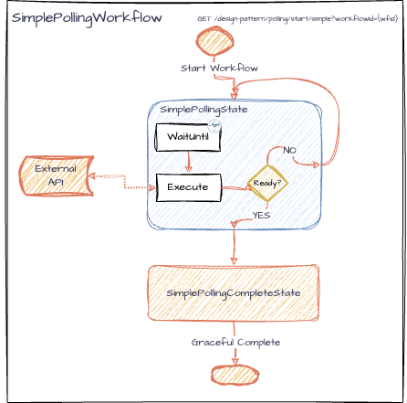
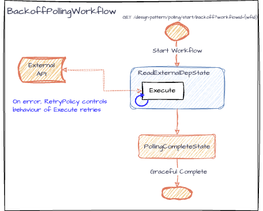

# Polling Workflow Patterns

Here we demonstrate two basic and common design patterns for building workflows with iWF:

1. **Simple Polling Workflow**: This workflow periodically checks if a system is ready using a TimerCommand, and proceeds to the next state once the system is ready.

2. **Backoff Polling Workflow**: This workflow is an alternative approach to the Simple Polling Workflow; it is using a retry mechanism (with exponential backoff) that proceeds to the next state once a successful response is received from the (external) system/API.

### Endpoints

The application exposes the following REST endpoints:

- **Start Simple Polling Workflow**:
  - `GET /design-pattern/polling/start/simple?workflowId={workflowId}`
  - Starts the Simple Polling Workflow with the specified `workflowId`.
- **Start Backoff Polling Workflow**:
  - `GET /design-pattern/polling/start/backoff?workflowId={workflowId}`
  - Starts the Backoff Polling Workflow with the specified `workflowId`.

## Use Cases
* **Waiting on External Conditions**
  * A workflow needs to wait for the correct conditions in an external system to exist before proceeding to the next state.
    * The external system can be checked at regular intervals to determine if the conditions are met.
    * Once the correct conditions are found in the external system, the workflow can proceed.
* **Data Ingestion from Remote Systems**
  * Your application needs to periodically ingest data from an external data provider, such as a real-time market data provider or a partner company’s system.
* **Resource Readiness in Cloud Environments**
  * Your application is dependent on the availability of cloud resources or infrastructure, such as waiting for a container, or database to be spun up before continuing with further
* **Payment Gateway Status Verification**
  * After initiating a payment, your workflow needs to continuously check the payment gateway until it verifies the status of the transaction before continuing.

## Choosing Between Backoff and Simple Polling

### **When to Use Backoff Polling**
Backoff polling (i.e. state API backoff retry) is most effective in scenarios where system conditions or external dependencies are unpredictable:

- **Less code** Overall, using state API retry means less code so is simpler to implement.
- **Unpredictable Startup Times**: The readiness of the resource may vary significantly due to factors like cloud provider load, making consistent polling inefficient.
- **API Rate Limits**: External services, such as cloud APIs, often impose rate limits. Backoff polling helps avoid hitting these limits by reducing the frequency of retries over time.
- **Cost Optimization**: Using state API will be a little cheaper on Temporal action and storage
  - Using State API means a shorter history (each backoff retry attempt will only cost one action, and will not need any extra history event) 
    => less Temporal storage cost

**Potential Drawbacks**:
  - State API RetryPolicy is less flexible; it has to be fixed interval, or backoff. Cannot be variable based on conditions.
  - Using State API will likely pollute the state API availability metrics which would require a little more work for monitoring.
    - Because State API expect to timeout/fail, you likely need to exclude those errors from (Datadog) monitoring queries.
  - If the polling intervals become too long and the resource becomes available earlier than anticipated, the workflow could face unnecessary delays.

### **When to Use Simple Polling**
Simple polling is most effective in scenarios where predictability and quick responsiveness are critical:

- **Need for Consistency**: If it is important to perform regular and predictable status checks—such as monitoring cloud resources—simple polling ensures a consistent cadence.
- **Quick Availability Expected**: If the resource typically becomes available within a short and predictable timeframe, consistent polling ensures the workflow proceeds without delay.
- **Low Resource Overhead**: When polling has minimal impact on system resources or API rate limits, simple polling provides a simple, straightforward solution.

**Potential Drawbacks**: 
  - When resource readiness takes longer than expected, simple polling can lead to excessive API calls, which may trigger rate limits or lead to unnecessary resource consumption.
  - Slightly more expensive on Temporal action and storage
    - Each polling attempt will use timerCommand+two activities (stateWaitUntil+stateExecute). It will also generate 10 history events: timerStarted, timerFired, activity (scheduled+Started+completed)*2
    - If the polling interval is very short, it could lead to a lot of actions and history events, which could increase Temporal costs

## Workflow Details

### Simple Polling Workflow

- **States**:
  - `SimplePollingState`: Periodically checks if the system is ready using a timer command.
  - `SimplePollingCompleteState`: Completes the workflow once the system is ready.

- **Polling Logic**: Uses a fixed interval timer (`TimerCommand`) and then checks system readiness.

 ([diagram link](https://drive.google.com/file/d/1rS42wYJ8aJiEGn1go2YJvaoQLQQYRsw0/view?usp=sharing))

### Backoff Polling Workflow

- **States**:
  - `ReadExternalDepState`: Attempts to read from an external dependency with retry logic.
  - `PollingCompleteState`: Completes the workflow with the result from the external dependency.

- **Retry Logic**: Uses exponential backoff with a maximum of 5 attempts and a maximum duration of 3600 seconds.

 ([diagram link](https://drive.google.com/file/d/1MDWE5rNuAV0zwgI0W15XawbV8jtf4p3e/view?usp=sharing))
