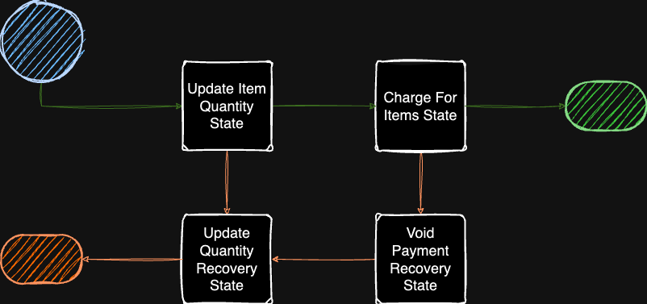

# Failure Recovery in iWF

## Overview

The key element to understanding the Failure Recovery in iWF is understanding
the difference between the iWF State API Backoff Retry and the Failure Recovery
feature. These two are independent, but strongly related. The Recovery Feature
is used when the iWF State API Backoff Retry attempts exhausted. The key concept
is to let state API retry for a number of times, and if finally failed, then go
to the recovery solution.

## iWF State API Backoff Retry and Failure Handling After Retry Exhausted

iWF State API (waitUntil/execute) will retry on any failure. If the retry policy
is not explicitly set, the default values will be used. By default, there is no
limit set for the number of failures. This means that the state API can fail
repeatedly until the workflow timeout is reached. The retry policy options and
their default values are as follows:

- InitialIntervalSeconds: 1
   - The initial amount time, in seconds, between a state failure and iWF
   retrying a state.
- MaxInternalSeconds: 100
   - The maximum amount of time, in seconds, between a state failure and iWF
   retrying a state.
- MaximumAttempts: 0
   - The maximum number of times iWF will retry a failing state.
   - `0` means infinite
- MaximumAttemptsDurationSeconds: 0
   - The maximum total time, in seconds, that iWF will allow a failing state to
   retry.
  - `0` means infinite
- BackoffCoefficient: 2
   - How quickly the time interval between state failure and retry increases
   with each failure.

This policy is primarily concerned with the `MaximumAttempts` and the
`MaximumAttemptsDurationSeconds` options. Their default values are set to 0,
meaning that a state will retry until the workflow timeout is reached.
`MaximumAttempts` tells iWF that, if this state API continues to fail, only
retry the state this number of times. `MaximumAttemptsDurationsSeconds` tells iWF
to continue retrying a failing state any number of times for a certain amount of
time. If only one is set, iWF will follow that setting. If both are set,
whichever threshold is reached first will determine when the state can no longer
be retried. If neither is set to a value other than 0, the state will retry
until the workflow reaches its timeout. The retry policy `MaximumAttempts` or
`MaximumAttemptsDurationSeconds` must be set to allow for failure recovery.

Along with having retry policies, the state API also has a failure recovery
policy. For the `waitUntil` API, the failure recovery policy is set with
`setProceedToExecuteWhenWaitUntilRetryExhausted`. The value passed will determine the
`WaitUntilApiFailurePolicy` to control state flow. At this time, is only supports
two options, false: `FAIL_WORKFLOW_ON_FAILURE` and true: `PROCEED_ON_FAILURE`.
`FAIL_WORKFLOW_ON_FAILURE` will fail a workflow if the `waitUntil` API has failed
out of its retry policy. `PROCEED_ON_FAILURE` will allow the state to proceed to
its `execute` API instead of failing the workflow.

For the `execute` API, the failure recovery policy is set with
`setProceedToStateWhenExecuteRetryExhausted`. The value passed will determine the
`ExecuteApiFailurePolicy` and allows for deciding between two options, null or default:
`FAIL_WORKFLOW_ON_FAILURE` and a specified state: `PROCEED_TO_CONFIGURED_STATE`. While the first
option is self-explanatory, the second allows the workflow to proceed to the
configured state instead of failing the workflow.

## Recovery with and without the Failure Recovery feature

### Without Failure Recovery feature

```java
public StateDecision execute(
    Context context,
    Void input,
    CommandResults commandResults) {
       try {
             doExecute();
       } catch (RetriableException ex) {
          if (context.getAttempt().get() > 5) {
              return StateDecision.singleNextState(FailureRecoveryState.class);    
          } else {
              throw ex;
         }
       }
    }
```

### With Failure Recovery feature

```java
public StateDecision execute(
    Context context,
    Void input,
    CommandResults commandResults) {
        doExecute();
}

@Override
public WorkflowStateOptions getStateOptions() {
    return new WorkflowStateOptions().setProceedToStateWhenExecuteRetryExhausted(FailureRecoveryState.class)
            .setExecuteApiRetryPolicy(new RetryPolicy().maximumAttempts(5)); // must have maximumAttempts or maximumAttemptsDurationSeconds otherwise it won't work, because the workflow will time out with no chance to run the recovery
}
```

## Why Use iWF's Recovery Pattern

iWF's Recovery Pattern simplifies the process of recovering from failures.
Instead of having to write a try-catch block for every state, the Recovery
Pattern can be applied by adding a single line of code to the
WorkflowStateOptions object.

## The Saga Pattern

Simply put, the Saga Pattern represents splitting up a transactional process
into steps that can be rolled back if any of the steps fail.

- Examples:
    - **Payment Processing**
    - **Online Purchases**

Saga Pattern is an architectural design pattern that’s intended to ensure state
consistency in multi-step and distributed business transactions. You can think of
the Saga pattern as a design pattern that ensures application consistency by using
compensations to revert the system to its last known good state when faced with
failure at any point in the transaction. [source:
[temporal.io](https://pages.temporal.io/download-saga-pattern-made-easy-pw.html)]

```java
class ProceedOnWaitUntilApiFailure1 implements WorkflowState<Void> {
   @Override
   public Class<Void> getInputType() {
       return Void.class;
   }

   @Override
   public WorkflowStateOptions getStateOptions() {
       return new WorkflowStateOptions()
               // Need to set the retry policy so that iWF knows when to let
               // the state proceed past its `waitUntil` API
               .setWaitUntilApiRetryPolicy(new RetryPolicy().maximumAttempts(5))
               // This tells iWF what to do when the `waitUntil` API has failed
               // too many times
               .setProceedToExecuteWhenWaitUntilRetryExhausted(true);
   }

   @Override
   public CommandRequest waitUntil(
         Context context,
         Void input,
         Persistence persistence,
         Communication communication) {
       int timerDuration = callSomeAPI();
       return CommandRequest.anyCommandCompleted(TimerCommand.createByDuration(timerDuration));
   }

    private int callSomeAPI() {
        System.out.println("Assuming calling some API");
        throw new RuntimeException("Fail at calling an API");
    }

   @Override
   public StateDecision execute(
         Context context,
         Void input,
         CommandResults commandResults,
         Persistence persistence,
         Communication communication) {
      if (commandResults.getWaitUntilApiSucceeded().isPresent()
            && commandResults.getWaitUntilApiSucceeded().get() == false) {
         throw new RuntimeException("`waitUntil` failed");
      }

      return StateDecision.singleNextState(ProceedOnWaitUntilApiFailure2.class, output);
   }
}
```

## Failure Recovery Workflow

This is a simplified example of an online ecommerce site handling an order being
placed. The golden path for this workflow includes reducing the current number
of items that are available and charging the buyer for the items ordered.
Because both of these actions can fail, both states include failure recovery
mechanisms that will roll back the actions that fail. For example, if the site
has run out of the requested item, that step will fail and the process should
revert any changes that were made.



### Key Components

1. `UpdateItemQuantityState`: This state handles reducing the number of items
that are available.

2. `ChargeForItemsState`: This state handles processing payments for the items
included in the order.

3. `UpdateQuantityRecoveryState`: This state handles undoing the work in the
`UpdateItemQuantityState` if either of the previous states fails.

4. `VoidPaymentRecoveryState`: This state ensures that customers won't be
charged if a payment fails for any reason.

5. `DatabaseConnection`: This class is used to stand in for a an actual database
which could fail to update.

6. `PaymentProcessor`: This class is used to simulate requesting payment for an
order. It will always fail to secure payment to force the workflow into recovery
states.

### API Endpoint

- Start a recovery workflow:

```
GET /recovery/start
   ?workflowId={workflowId}
   &itemName={itemName}
   &quantity={quantityRequested}
```

This endpoint will start a recovery workflow with the with the specified
workflowId, item name, and number of items to order

## References

- A more in depth explanation of the SAGA pattern and how it can be used with
iWF can be found [in this
article](https://medium.com/@qlong/saga-pattern-deep-dive-with-indeed-workflow-engine-b7e82c59e51f).

- [iWF Workflow Options Wiki](https://github.com/indeedeng/iwf/wiki/WorkflowStateOptions)
