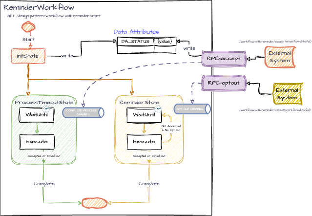

# Reminder Workflow Pattern

This document describes the Reminder Workflow Pattern implemented using iWF. 
The Reminder Workflow Pattern allows a workflow to send periodic reminders to users, handle user opt-out requests, and manage timeouts. 
This is particularly useful in scenarios where user engagement is critical, and automated follow-ups are needed to ensure tasks are completed.

### Key Components

1. **ReminderWorkflow**: The main workflow class that defines the states and handles reminders and timeouts.
2. **InitState**: The initial state that sets up the workflow and transitions to the process timeout and reminder states.
3. **ProcessTimeoutState**: Handles the timeout process and updates an external system.
4. **ReminderState**: Handles processing user opt-out signals, sending reminders, and looping back to wait for the next reminder or opt-out.

### Endpoints

The application exposes the following REST endpoints for managing the reminder workflow:

- **Start Reminder Workflow**:
  - `GET /design-pattern/workflow-with-reminder/start`
  - Starts the Reminder Workflow and returns a `workflowId`.

- **Accept Reminder Workflow**:
    - `GET /design-pattern/workflow-with-reminder/accept?workflowId={workflowId}`
    - Accepts the workflow, changing its status to ACCEPTED and publishing a completion signal.

- **Opt Out Reminder Workflow**:
    - `GET /design-pattern/workflow-with-reminder/optout?workflowId={workflowId}`
    - Signals the workflow to opt out of the process without accepting it.

## Use Cases and Considerations

### **Use Cases**

- **Automated Reminders**: Send reminders automatically to users who haven't responded to a request.
- **User Opt-Out**: Allow users to stop receiving future reminders.
- **Timeout Management**: Manage cases where users do not respond within a set timeframe.

### **Considerations**

- **Effective Reminders**: Ensure reminders are useful and avoid appearing as spam.
- **Opt-Out Compliance**: Respect user preferences and comply with opt-out requests.
- **Timeout Settings**: Set balanced timeout durations to optimize response rates and workflow efficiency.

## Workflow Details

### Reminder Workflow

- **States**
  - `InitState`: Initializes the workflow by setting the initial status and starting the process timeout and reminder states.
  - `ProcessTimeoutState`: Handles the timeout process and updates an external system.
  - `ReminderState`: Handles processing user opt-out signals, sending reminders, and looping back to wait for the next reminder or opt-out.

- **Reminder Logic**
  - Uses a timer to periodically send reminders and check for user opt-out signals. If a user opts out, the workflow stops sending reminders. If the status is accepted, the workflow completes.

 ([diagram link](https://drive.google.com/file/d/1aaOn-5udljwlEBw41xOdQTBEAoXTbDgv/view?usp=sharing))

## Conclusion

The Reminder Workflow Pattern provides a structured approach to managing user engagement through automated reminders and opt-out handling. 
By leveraging the iWF framework, this pattern enables efficient timeout management and ensures tasks are completed in a timely manner, optimizing user interaction and workflow efficiency.
