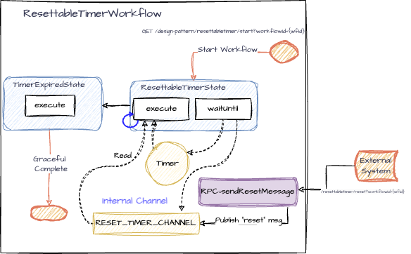

# Resettable Timer Workflow Pattern

Here we demonstrate a basic and common design pattern for building workflows with iWF:

1. **Resettable Timer Workflow**: This workflow starts a timer with predefined duration value that can be reset before firing.

### Endpoints

The application exposes the following REST endpoints:

- **Start Resettable Timer Workflow**:
  - `GET /design-pattern/resettabletimer/start?workflowId={workflowId}`
  - Starts the Resettable Timer Workflow with the specified `workflowId`.
- **Reset the timer**:
  - `GET /design-pattern/resettabletimer/reset?workflowId={workflowId}`
  - Resets timer for the Resettable Timer Workflow with the specified `workflowId`.

## Use Cases
* **Sending a reminder notification**
  * You want to remind a user to take an action after a period of inactivity. Every time user becomes active the timer resets
* **Cleaning up data after a period of inactivity**
  * Your application should only store data temporarily and clean up the saved data if user has been inactive / flow has been abandoned, etc.
* **Any scenario where an action needs to be taken after timer expires with an option to reset timer**
  * Time sensitive processes where action should be taken after the timer expiration

## Workflow Details

- **States**:
  - `ResettableTimerState`: The initial state of this workflow where a message to reset timer is awaited. Allowing the timer to expire before a message was received will move the workflow to TimerExpiredState
  - `TimerExpiredState`: Leads to graceful completion of the workflow. Before the workflow is completed, an action can be taken.

 ([diagram link](https://drive.google.com/file/d/13xR4dKN5QSCDEMLCkTaY3Za6guNwMubd/view?usp=sharing))

