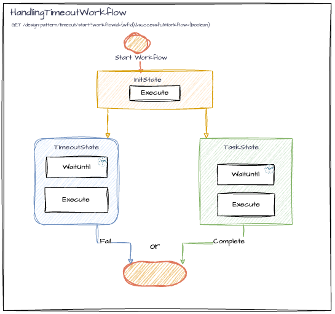

# HandlingTimeoutWorkflow

## Overview

The `HandlingTimeoutWorkflow` serves as an example of managing tasks using a timeout mechanism. This workflow ensures that tasks are completed within a designated time frame. If a task exceeds this duration, the workflow can forcibly terminate to prevent endless execution or a log can be emitted and the state can return `StateDecision.deadEnd()`.

## Workflow Details


<br>([diagram link](https://drive.google.com/file/d/1MZXEXlF3WbzwFAaove0cySbbC798KPlV/view?usp=drive_link))

### Workflow States

- **InitState**: Accepts a `Boolean` indicating whether the workflow should simulate a successful or long-running task that exceeds the timeout. Transitions to both `TimeoutState` and `TaskState` simultaneously, allowing them to run in parallel.
- **TimeoutState**: Waits for a timer to complete, set to 1 minute. If the timer completes before the task, it forcefully fails the workflow, indicating that the task did not finish in time.
- **TaskState**: Represents the main task execution within the workflow. Accepts a `Boolean` to determine if the task should complete successfully or exceed the timeout. If simulating a delay, waits for a timer longer than the timeout (65 seconds) fails the workflow. If the task completes successfully, it forcefully completes the workflow, closing the timeout state thread.

### Usage

1. Start a workflow using an endpoint. Example:
```http request
http://localhost:8080/design-pattern/timeout/start?workflowId=handleTimeoutWorkflow
```
2. If you want the timeout state to be triggered add the parameter `successfulWorkflow=false`
```http request
http://localhost:8080/design-pattern/timeout/start?workflowId=handleTimeoutWorkflow&successfulWorkflow=false
```
