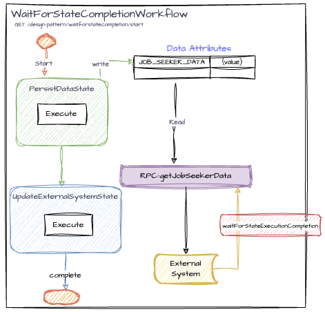

# WaitForStateCompletionWorkflow

This workflow serves as a model to simplify the process of notifying the client/caller that an operation has been successfully completed, while another background process is started.
The state(s) used for the waitForCompletionState feature or the waitForCompletionStates (with "s") feature (for multiple states that can be waited for) must be configured in the WorkflowOptions when a workflow is started. 

## Endpoints

To start the `WaitForStateCompletionWorkflow', use the following REST endpoint:

```http request
GET /design-pattern/waitforstatecompletion/start?workflowId={workflowId}
```

## Use Cases

- Replacing Mongo Change Data Capture (CDC): To kick off a background operation after database write people usually would use database CDC(change data capture) technology, which is very heavy and complex. This pattern can simplify the whole architecture to a few lines of code.
- Frontend data needed for rendering: If a UI element needs data to render, the waitForStateCompletion feature can be used to return data to the frontend, while another background process is started. 
- Replacing querying a datastore in a loop: Instead of continuously querying the data store to confirm that data is persisted, a caller/client can use the waitForStateCompletion feature to know when the data is persisted. 

## Workflow Details


<br>([diagram_link](https://drive.google.com/file/d/1T_Tp5ZCoq7l2bVFD7gByHVVaXuTmeMRI/view?usp=drive_link))

### Workflow States

The workflow consists of the following state:

- **PersistDataState**: The starting state of the workflow, responsible for persisting job seeker data using the provided mocked `mongoCollection`.
- **UpdateExternalSystemState**: Publishes job seeker data to an external system.

### Persistence

The workflow uses a persistence schema to define the data attributes that need to be stored. In this case, it includes:

- **Data Attribute**: `JOB_SEEKER_DATA`
    - **Type**: `JobSeekerData`
    - **Description**: Stores the job seeker information that is required for the workflow operations.

### RPC Method: `getJobSeekerData`

- **Description**: Retrieves the job seeker data from the persistence layer.
- **Returns**: `JobSeekerData` object containing the job seeker information.
- **Throws**: `IllegalStateException` if the job seeker data is not found in the data store.

### Usage

To start a `WaitForStateCompletionWorkflow`, use the above endpoint. Example:

```http request
http://localhost:8080/design-pattern/waitforstatecompletion/start?workflowId=waitforstatecompletion_1
```
*NOTE* See the controller for how waitForCompletionState is configured on start. Example:

```
  WorkflowOptions.extendedBuilder()
          .waitForCompletionState(PersistDataState.class)
          .getBuilder()
          .build());
```
