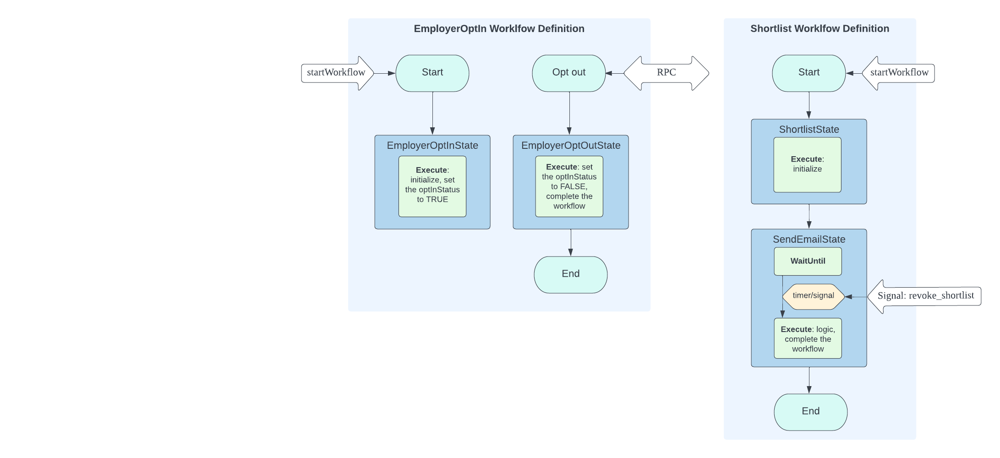

# Use case

In job searching and hiring websites like [Indeed](https://indeed.com), employers can opt in for an automation workflow to enhance the possibility of establishing connections with candidates by automatically contacting shortlisted candidates.

Once an employer shortlists a candidate as potentially hireable, the automation workflow will initiate:


# API requirements

* **/opt_in**: An API for employers to opt into the automation workflow.
* **/opt_out**: An API for employers to opt out of the automation workflow.
* **/shortlist**: An API for employers to shortlist a candidate.
* **/revoke_shortlist**: An API for employers to revoke the shortlist.

# Design

In this demo, we will delve into the utilization of the workflow designed for long-term storage. 
Specifically, we will focus on leveraging the attributes of iWF to retain the employer opt-in information.

We will requite two distinct workflows: one to oversee the employer opt-in process and another to handle the shortlisting.

In the employer opt-in workflow, a continuous long-running workflow will commence when an employer chooses to participate in the automation.
If the employer decides to opt out, the ongoing workflow will be completed.
Additionally, there will be a maximum of one active workflow per employer.

In the shortlisting workflow, a fresh workflow will be initiated once an employer shortlists a candidate. 
The workflow will incorporate a timer to schedule the sending of an email, and it can be completed without sending the email at any point if the employer revokes the shortlisting.

The overall design of the workflows is as follows:



# How to run

First of all, you need to register the required search attributes.

## Search attribute requirement

If using Temporal:

* New CLI (Temporal)
```bash
temporal search-attribute create -name EMPLOYER_OPT_IN_EmployerId -type Keyword -y
temporal search-attribute create -name SHORTLIST_EmployerId -type Keyword -y
temporal search-attribute create -name SHORTLIST_CandidateId -type Keyword -y
```

* Old CLI (tctl)
``` bash
tctl adm cl asa -n EMPLOYER_OPT_IN_EmployerId -t Keyword
tctl adm cl asa -n SHORTLIST_EmployerId -t Keyword
tctl adm cl asa -n SHORTLIST_CandidateId -t Keyword
```

If using Cadence:

```bash
cadence adm cl asa --search_attr_key EMPLOYER_OPT_IN_EmployerId --search_attr_type 1
cadence adm cl asa --search_attr_key SHORTLIST_EmployerId --search_attr_type 1
cadence adm cl asa --search_attr_key SHORTLIST_CandidateId --search_attr_type 1
```

## Test the APIs in [Postman](https://www.postman.com)

* See the [ShortlistCandidatesController](https://github.com/indeedeng/iwf-java-samples/blob/main/src/main/java/io/iworkflow/controller/ShortlistCandidatesController.java).
